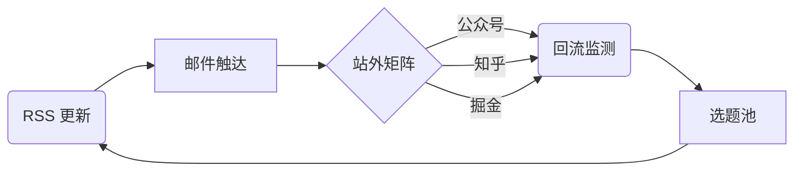

## 构建增长飞轮

合理的分发体系应该覆盖 **RSS → 邮件 → 站外平台 → 回流监控** 四个阶段，通过埋点数据不断优化投放效率。

### 分发节点

1. **RSS**：生成 `feed.xml`，供聚合器自动抓取。
2. **邮件订阅**：采用 Double Opt-in，确保订阅者意愿真实。
3. **站外矩阵**：将正文拆分为摘要 + 原文链接，分发至公众号、知乎、掘金等。
4. **反馈闭环**：采集 PV/UV、分享量、回流线索，并纳入选题决策。

## 数据指标

- 站外分发 24 小时内的回流 PV。
- 邮件开启率与点击率。
- 订阅新增与退订原因。

## 运维提示

确保各渠道的 API Token 与密钥按环境隔离，避免生产事故影响测试环境；同时在 CI 中加入“新链接主动推送”脚本，使搜索引擎第一时间收录最新内容。
